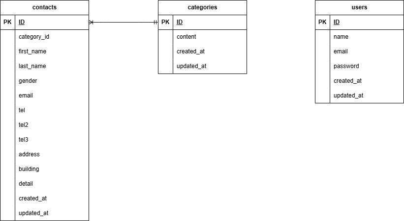

# お問い合わせフォーム

### Laravel環境構築
- 環境は自作です。

1. ディレクトリの作成
1. Docker-compose.yml の作成
1. Nginx の設定
1. PHP の設定
1. MySQL の設定
1. phpMyAdmin の設定
1. docker-compose up -d --build
1. docker-compose exec php bash
1. Laravelプロジェクトを作成（composer create-project "laravel/laravel=8.*" . --prefer-dist）
1. 時間設定の編集
1. .envファイルの編集
1. php artisan migrate
1. php artisan db:seed

## 使用技術(実行環境)
- Laravel 8
- PHP 7.4.9
- Mysql 8.0.26

## ER図

## URL
- 開発環境：http://localhost/
- phpMyAdmin：http://localhost:8080/

## 制作状況
お問い合わせフォーム：http://localhost/
お問い合わせ確認ページ：http://localhost/confirm
サンクスページ：http://localhost/thanks

#### 実装範囲
- 入力フォームの構築（カテゴリ・性別など）
- 確認画面の表示と hiddenフィールドによる送信処理
- DB保存、サンクスページ遷移

#### 未着手項目
- 確認ページの修正ボタンから問い合わせフォームへ戻ってもデータ引継ぎなし
- バリデーション設定

ログインページ：http://localhost/login
登録ページ：http://localhost/register

#### 実装範囲
TestControllerにてviewファイルを表示

#### 未着手項
- 未実装

管理画面：http://localhost/admin

#### 制作範囲
viewファイル未作成
